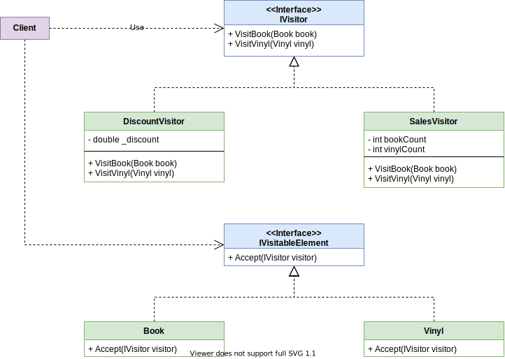

# Visitor Pattern

## Introduction
The **Visitor** pattern is a behavioral design pattern that lets you separate algorithms from the objects on which they operate. It represents an operation to be performed on the elements of an object structure without changing the classes of the elements on which it operates

## Use cases

> Not for everything - all added class beahavior doesn't need to be implemented with the visitor pattern

✔ When a project has a variety of classes, with different interfaces and inheritance structures , that need added class-specific behavior

✔ When different and unrelated behaviors need to be applied without polluting the existing classes

✔ When the existing class structure is unlikely to change, but new behavior needs to be added at will.

## Structure

1. The **IVisitor** interface declares a set of visiting methods that can take concrete elements of an object structure as arguments. These methods may have the same names if the program is written in a language that supports overloading, but the type of their parameters must be different.
2. Each **Concrete Visitor** implements several versions of the same behaviors, tailored for different concrete element classes.
3. The **IVisitableElement** interface declares a method for “accepting” visitors. This method should have one parameter declared with the type of the visitor interface.
4. Each **Concrete Element** must implement the acceptance method. The purpose of this method is to redirect the call to the proper visitor’s method corresponding to the current element class. Be aware that even if a base element class implements this method, all subclasses must still override this method in their own classes and call the appropriate method on the visitor object.
5. The **Client** usually represents a collection or some other complex object (for example, a shopping cart). Usually, clients aren’t aware of all the concrete element classes because they work with objects from that collection via some abstract interface.

## Cons

❗ Changing the class hierarchy while using the visitor pattern can be costly. You could have to update all visitors.

❗ Encapsulation can potentially be broken, as the visitor pattern often needs access to the internal state of your elements to do its jobs.